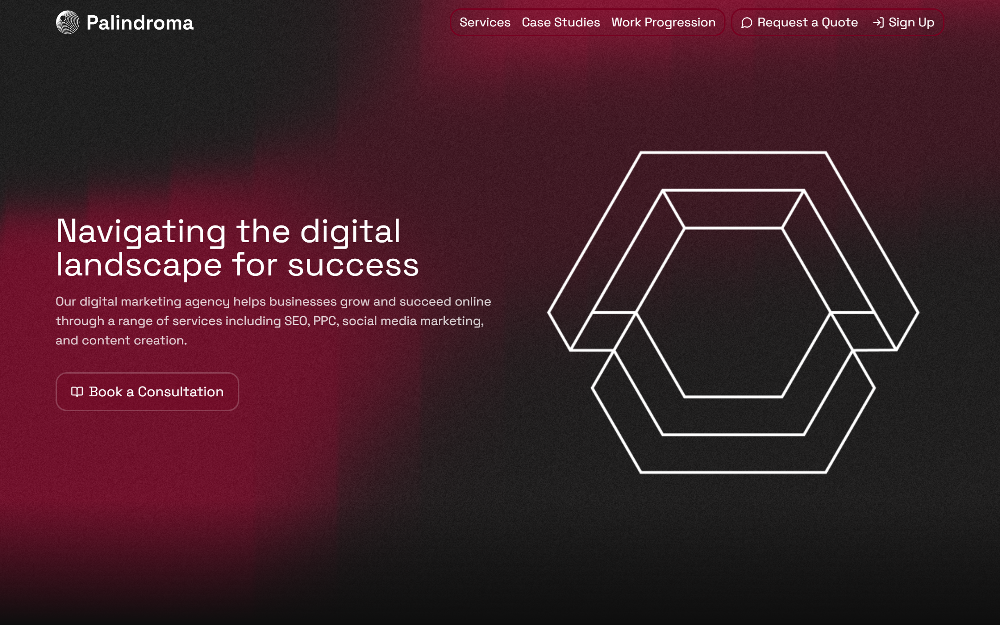
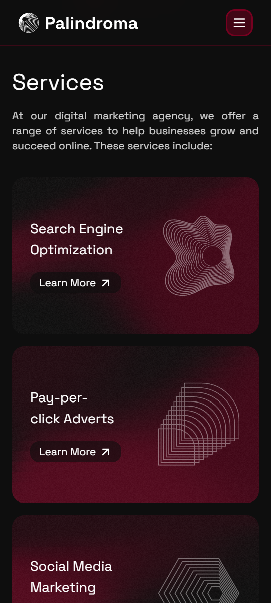
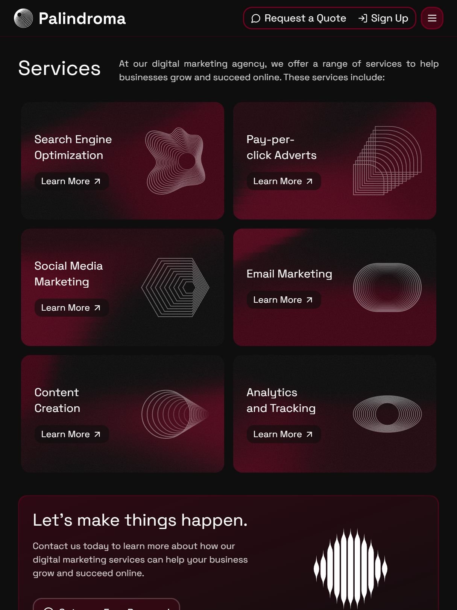

# Palisto Project - Next.js Website Template

### 😻 Special Thanks to [Frontend Tribe](https://www.youtube.com/channel/UCKZZiXKJ8rU7LkRaTS2CDcA) - [Project Video](https://www.youtube.com/watch?v=7hi5zwO75yc)

Palisto Project is a sleek, modern, and fully responsive website template built with Next.js and Motion.dev. It's designed to provide a robust starting point for developers looking to build applications with a clean layout or designers looking for ideas.



---

## Built With

This project leverages modern web technologies:

- [![Next][Next.js]][Next-url]
- [![React][React.js]][React-url]
- [![Tailwind CSS][TailwindCSS]][TailwindCSS-url]
- [![Motion][Motion.dev]][Motion.dev-url]

<!-- MARKDOWN LINKS & IMAGES -->

[Next.js]: https://img.shields.io/badge/Next.js-000000?style=for-the-badge&logo=nextdotjs&logoColor=white
[Next-url]: https://nextjs.org/
[React.js]: https://img.shields.io/badge/React-20232A?style=for-the-badge&logo=react&logoColor=61DAFB
[React-url]: https://reactjs.org/
[TailwindCSS]: https://img.shields.io/badge/Tailwind_CSS-38B2AC?style=for-the-badge&logo=tailwind-css&logoColor=white
[TailwindCSS-url]: https://tailwindcss.com/
[Motion.dev]: https://img.shields.io/badge/Framer_Motion-0055FF?style=for-the-badge&logo=framer&logoColor=white
[Motion.dev-url]: https://motion.dev/

---

## Key Features

- **Next.js 15:** Built on the latest version of the React framework.
- **TypeScript:** Pre-configured for a better development experience.
- **Tailwind CSS:** A utility-first CSS framework for rapid UI development.
- **Responsive Design:** Mobile-first approach ensures compatibility across all screen sizes.

<div align="center">
 
 
</div>

---

## Getting Started

Follow these steps to get a local copy up and running.

1.  Clone the repo
    ```
    git clone https://github.com/skarwuuu/2-template-uuu.git
    ```
2.  Install node_modules folder
    ```
    pnpm install
    ```
3.  Run the development server
    ```
    pnpm run dev
    ```
    Your project is now running at `http://localhost:3000`.

---

## Contact

Twitter - [@skarwuuu](https://x.com/skarwuuu)
